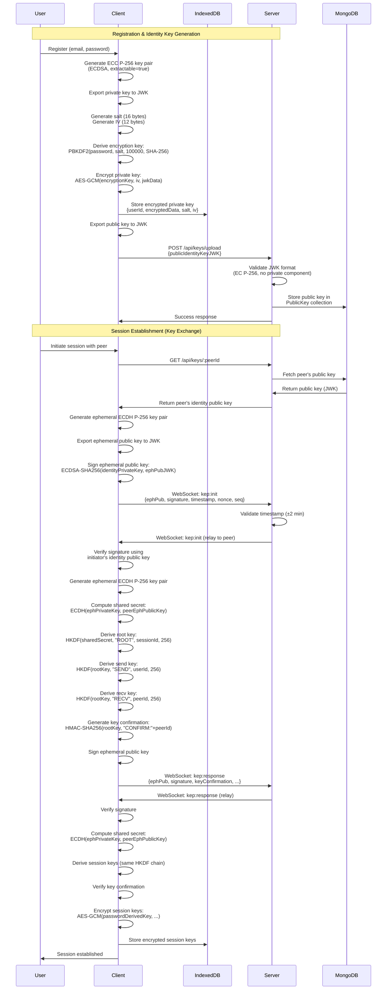

# Cryptographic Design

**Version:** 1.0  
**Last Updated:** 2025-01-27  
**Status:** Complete

---

## Table of Contents

1. [Overview](#overview)
2. [Key Materials](#key-materials)
3. [Key Generation Process](#key-generation-process)
4. [Key Generation Diagram](#key-generation-diagram)
5. [Security Considerations](#security-considerations)
6. [Missing Details](#missing-details)

---

## Overview

This document describes the complete cryptographic architecture for the end-to-end encrypted messaging system. The implementation uses only native Web Crypto API (browser) and Node.js crypto modules—no external E2EE libraries are used.

The system provides:

- **Identity Key Pairs**: Long-lived ECC P-256 keys for signing ephemeral keys and establishing cryptographic identity
- **Ephemeral Key Exchange**: Authenticated ECDH protocol for session establishment with forward secrecy
- **Session Key Derivation**: HKDF-based key derivation for secure message encryption
- **Secure Storage**: IndexedDB with password-based encryption for private keys
- **Replay Protection**: Timestamp, nonce, and sequence number validation

All cryptographic operations are performed client-side. The server acts as a relay for encrypted messages and public keys, but cannot decrypt any content.

---

## Key Materials

### Identity Keys

**Purpose**: Long-term cryptographic identity used for signing ephemeral keys during key exchange.

**Type**: ECC P-256 (prime256v1) using ECDSA

**Properties**:
- Algorithm: ECDSA
- Curve: P-256
- Key size: 256 bits
- Private key extractable: `true` (required for encrypted storage)
- Public key extractable: `true` (required for JWK export)
- Usages: `['sign']` for private key, `['verify']` for public key

**Storage**:
- Private key: Encrypted in IndexedDB using AES-GCM with password-derived key
- Public key: Stored on server in MongoDB `PublicKey` collection (plaintext, by design)

**Lifecycle**:
- Generated once per user during registration
- Loaded into memory on each login (decrypted with password)
- Used for signing ephemeral keys and key update messages
- Rotation recommended after 90 days (optional, on-demand)

### Ephemeral Keys

**Purpose**: Short-lived keys used for ECDH key exchange to establish session keys.

**Type**: ECDH P-256

**Properties**:
- Algorithm: ECDH
- Curve: P-256
- Generated per session during key exchange protocol
- Stored in memory only (never persisted)
- Discarded immediately after shared secret computation

**Lifecycle**:
- Generated during key exchange protocol (KEP)
- Single-use (discarded after session establishment)
- Can be rotated periodically for forward secrecy
- Provides forward secrecy: compromised keys cannot decrypt past messages

### Session Keys

**Purpose**: Derived keys used for encrypting and decrypting messages.

**Derivation**: HKDF-SHA256 from ECDH shared secret

**Key Types**:
- **Root Key**: 256 bits, derived from shared secret
- **Send Key**: 256 bits, derived from root key (for outgoing messages)
- **Receive Key**: 256 bits, derived from root key (for incoming messages)

**Storage**:
- Encrypted in IndexedDB using AES-GCM with password-derived key
- Cached in memory during active sessions
- Session encryption key cache expires after 1 hour

**Usage**:
- Send key: Encrypts outgoing messages (AES-256-GCM)
- Receive key: Decrypts incoming messages (AES-256-GCM)
- Keys remain valid until session ends or key rotation occurs

---

## Key Generation Process

### Registration Flow

1. **User Registration**:
   - User completes registration form (email, password)
   - Client-side JavaScript calls `crypto.subtle.generateKey()` with ECC P-256 parameters

2. **Identity Key Generation**:
   - Web Crypto API generates ECC P-256 key pair using ECDSA
   - Algorithm: `{name: 'ECDSA', namedCurve: 'P-256'}`
   - Keys are extractable: `true`
   - Usages: `['sign', 'verify']`

3. **Private Key Storage**:
   - Export private key to JWK format: `crypto.subtle.exportKey('jwk', privateKey)`
   - Serialize JWK to ArrayBuffer (UTF-8 encoding)
   - Generate random salt: 16 bytes using `crypto.getRandomValues()`
   - Generate random IV: 12 bytes (96 bits) for AES-GCM
   - Derive encryption key: `PBKDF2(password, salt, 100000, SHA-256)` → 256-bit AES-GCM key
   - Encrypt private key: `AES-GCM(encryptionKey, iv, jwkData)`
   - Store in IndexedDB: `InfosecCryptoDB.identityKeys` with structure:
     ```
     {
       userId: string,
       encryptedData: Uint8Array,
       salt: Uint8Array (16 bytes),
       iv: Uint8Array (12 bytes),
       createdAt: ISO string
     }
     ```

4. **Public Key Export**:
   - Export public key to JWK format: `crypto.subtle.exportKey('jwk', publicKey)`
   - JWK format: `{kty: "EC", crv: "P-256", x: <base64>, y: <base64>}`

5. **Public Key Upload**:
   - Send JWK to server via `POST /api/keys/upload`
   - Requires authenticated user (JWT token)
   - Server validates key format (must be EC P-256, no private key component)
   - Server stores in MongoDB `PublicKey` collection:
     ```
     {
       userId: ObjectId,
       publicIdentityKeyJWK: JWK object,
       keyHash: SHA-256 hash,
       version: number,
       createdAt: Date,
       updatedAt: Date
     }
     ```

### Session Establishment Flow

1. **Key Exchange Initiation**:
   - Initiator fetches peer's identity public key from server: `GET /api/keys/:peerId`
   - Server returns public key in JWK format

2. **Ephemeral Key Generation**:
   - Generate ephemeral ECDH key pair: `crypto.subtle.generateKey({name: 'ECDH', namedCurve: 'P-256'}, true, ['deriveKey'])`
   - Export ephemeral public key to JWK format
   - Keep ephemeral private key in memory (not stored)

3. **Ephemeral Key Signing**:
   - Sign ephemeral public key with identity private key
   - Algorithm: `{name: "ECDSA", hash: "SHA-256"}`
   - Data signed: `JSON.stringify(ephemeralPublicKeyJWK)`
   - Signature: Base64-encoded

4. **KEP_INIT Message**:
   - Create message with signed ephemeral public key
   - Include timestamp, nonce (16 bytes), sequence number
   - Send via WebSocket: `socket.emit("kep:init", message)`

5. **Key Exchange Response**:
   - Responder verifies timestamp (±2 minutes window)
   - Verifies signature using initiator's identity public key
   - Generates own ephemeral key pair
   - Computes shared secret: `ECDH(ephemeralPrivateKey, peerEphemeralPublicKey)`
   - Derives session keys using HKDF
   - Generates key confirmation HMAC
   - Signs own ephemeral public key
   - Sends KEP_RESPONSE message

6. **Session Key Derivation**:
   - Both parties compute shared secret via ECDH (256 bits)
   - Derive root key: `HKDF(sharedSecret, salt="ROOT", info=sessionId, length=256 bits, hash=SHA-256)`
   - Derive send key: `HKDF(rootKey, salt="SEND", info=userId, length=256 bits, hash=SHA-256)`
   - Derive receive key: `HKDF(rootKey, salt="RECV", info=peerId, length=256 bits, hash=SHA-256)`

7. **Key Confirmation**:
   - Responder computes: `HMAC-SHA256(rootKey, "CONFIRM:" + initiatorUserId)`
   - Initiator verifies key confirmation matches computed value
   - If match: Session established
   - If mismatch: Session rejected, keys discarded

8. **Session Storage**:
   - Encrypt session keys (rootKey, sendKey, recvKey) using password-derived key
   - Store encrypted session in IndexedDB: `InfosecCryptoDB.sessions`
   - Session structure:
     ```
     {
       sessionId: string,
       userId: string,
       peerId: string,
       rootKey: {encrypted, iv, authTag},
       sendKey: {encrypted, iv, authTag},
       recvKey: {encrypted, iv, authTag},
       lastSeq: number,
       lastTimestamp: number,
       createdAt: ISO string,
       updatedAt: ISO string,
       encrypted: true
     }
     ```

---

## Key Generation Diagram

### Mermaid Sequence Diagram



### Plain Text Key Generation Flow

**Step 1: User Registration**
- User submits registration form with email and password
- Client generates ECC P-256 identity key pair using Web Crypto API

**Step 2: Private Key Encryption**
- Export private key to JWK format
- Generate random 16-byte salt and 12-byte IV
- Derive 256-bit AES-GCM encryption key from password using PBKDF2 (100,000 iterations, SHA-256)
- Encrypt private key JWK using AES-GCM
- Store encrypted data, salt, and IV in IndexedDB

**Step 3: Public Key Upload**
- Export public key to JWK format
- Send public key to server via POST /api/keys/upload
- Server validates JWK format (must be EC P-256, no private component)
- Server stores public key in MongoDB PublicKey collection

**Step 4: Session Initiation**
- Initiator fetches peer's identity public key from server
- Initiator generates ephemeral ECDH P-256 key pair
- Initiator signs ephemeral public key with identity private key
- Initiator sends KEP_INIT message via WebSocket

**Step 5: Key Exchange Response**
- Responder verifies timestamp and signature
- Responder generates ephemeral ECDH P-256 key pair
- Responder computes shared secret via ECDH
- Responder derives session keys using HKDF chain
- Responder generates key confirmation HMAC
- Responder sends KEP_RESPONSE message

**Step 6: Session Key Derivation**
- Both parties compute identical shared secret via ECDH
- Both derive root key: HKDF(sharedSecret, "ROOT", sessionId, 256 bits)
- Both derive send key: HKDF(rootKey, "SEND", userId, 256 bits)
- Both derive receive key: HKDF(rootKey, "RECV", peerId, 256 bits)

**Step 7: Key Confirmation**
- Responder includes key confirmation HMAC in KEP_RESPONSE
- Initiator verifies key confirmation matches computed value
- If verified: Session established, keys stored encrypted in IndexedDB
- If mismatch: Session rejected, keys discarded

**Step 8: Session Storage**
- Encrypt session keys (rootKey, sendKey, recvKey) using password-derived key
- Store encrypted session in IndexedDB with metadata (sessionId, userId, peerId, timestamps)

---

## Security Considerations

### Private Key Protection

- **Storage**: Private keys never stored in plaintext
- **Encryption**: AES-GCM with password-derived key (PBKDF2, 100,000 iterations, SHA-256)
- **Extractability**: Keys are extractable for encrypted storage, but never transmitted unencrypted
- **Location**: Private keys remain exclusively on client device (IndexedDB)
- **Access**: Decryption requires user password; keys cleared from memory on logout

### Key Derivation Security

- **PBKDF2 Hardness**: 100,000 iterations provide reasonable protection against brute-force attacks
- **Salt Randomness**: 16-byte random salt per key prevents rainbow table attacks
- **IV Randomness**: 12-byte random IV per encryption ensures unique ciphertexts
- **HKDF Security**: SHA-256 provides collision resistance; context-specific salts prevent key reuse

### Cryptographic Assumptions

- **ECDH Security**: P-256 provides 128 bits of security
- **HKDF Security**: SHA-256 is collision-resistant
- **AES-GCM Security**: AES-256-GCM provides authenticated encryption
- **ECDSA Security**: ECDSA with SHA-256 provides strong signature security

### Threat Mitigation

- **MITM Attacks**: Identity key signatures prevent man-in-the-middle attacks on key exchange
- **Replay Attacks**: Timestamp validation (±2 minutes), nonce uniqueness, and sequence numbers prevent replay
- **Key Compromise**: Forward secrecy limits damage from ephemeral key compromise
- **Message Tampering**: AES-GCM authentication tags detect tampering
- **Password Weakness**: Strong password requirements recommended (not enforced in current implementation)

### Limitations

- **No Perfect Forward Secrecy for Sessions**: If root key is compromised, all session messages can be decrypted
- **Single Device**: Identity keys stored per browser/device (no multi-device sync)
- **No Key Backup**: Lost password results in lost identity key (by design)
- **Browser Compromise**: Malicious browser extensions can access keys in memory
- **Key Rotation**: Identity key rotation is optional (recommended after 90 days), not automatic

---

## Missing Details

The following details have been clarified through code analysis:

### 1. Key Rotation Frequency

**Identity Keys**:
- Rotation is **manual/on-demand only** (not automatic)
- Recommendation function exists: `shouldRotateIdentityKey(keyCreatedAt, maxAgeDays = 90)`
- Function checks if key age exceeds 90 days, but rotation must be initiated manually
- No automatic rotation schedule is implemented

**Ephemeral Keys**:
- Rotation is **manual/on-demand only** ("periodic or on demand" means user-initiated)
- No automatic rotation interval is defined
- Rotation occurs when user explicitly calls `rotateKeys()` or `initiateKeyRotation()`

### 2. Session Key Expiration

**Session Encryption Key Cache**:
- Expires after **1 hour** (60 * 60 * 1000 milliseconds)
- Cached in memory: `sessionEncryptionKeyCache.set(userId, {key, expiresAt})`
- Expiration checked before use: `if (cached && cached.expiresAt > Date.now())`

**Session Keys (rootKey, sendKey, recvKey)**:
- **No explicit expiration policy**
- Keys remain valid until:
  - Session ends (user logs out or session deleted)
  - Key rotation occurs (new keys derived)
- Keys persist in IndexedDB until explicitly deleted

### 3. IndexedDB Migration Strategy

**Current Implementation**:
- Database versions tracked: `identityKeys` (v1), `sessions` (v2)
- `onupgradeneeded` handlers create object stores if they don't exist
- **No data migration logic exists** for schema changes

**Migration Limitations**:
- When `DB_VERSION` is incremented, IndexedDB triggers `onupgradeneeded`
- Code only creates missing object stores; does not migrate existing data
- Schema changes (e.g., adding new fields) may result in data loss or require manual migration
- No documented procedure for handling version upgrades with existing data

**Recommendation**: Implement data migration logic in `onupgradeneeded` handlers when schema changes occur.

### 4. Error Handling

**Web Crypto API Error Handling**:
- Standard try-catch blocks with descriptive error messages
- Specific error types handled:
  - `OperationError`: Decryption failures (authentication tag verification)
    - Error message: "Decryption failed: Authentication tag verification failed"
    - Thrown when AES-GCM auth tag verification fails

**Error Logging**:
- Client-side: Errors logged to console with descriptive messages
- Server-side: Security events logged via `logEvent()` function
- Log files (documented in KEY_EXCHANGE_PROTOCOL.md):
  - `invalid_signature.log`: Signature verification failures
  - `replay_attempts.log`: Timestamp/sequence violations

**Error Recovery**:
- Cryptographic operation failures throw errors that propagate to calling code
- No automatic retry mechanisms
- User-facing error messages: Generic error messages returned (e.g., "Failed to rotate keys: {error.message}")
- Recovery procedures: Not fully documented; errors typically require user action (retry operation, re-authenticate, etc.)

### 5. Key Revocation Procedure

**Client-Side Revocation**:
- `deleteIdentityKey(userId)`: Deletes encrypted private key from IndexedDB
- `deleteSession(sessionId)`: Deletes session and encrypted session keys from IndexedDB
- Functions available but workflow not fully documented

**Server-Side Revocation**:
- **No DELETE endpoint exists** for public key revocation
- Public keys can be **updated/replaced** via `POST /api/keys/upload` (upsert operation)
- Public key model supports versioning (`version`, `previousVersions` array)
- **No explicit revocation/deletion endpoint** for removing public keys from server
- Key replacement workflow: Upload new key → old key archived in `previousVersions` array

**Recommendation**: Implement `DELETE /api/keys/me` endpoint for explicit public key revocation.

---

**Document Version**: 1.0  
**Last Updated**: 2025-01-27  
**Source Files**: `README.md`, `docs/cryptography/PHASE3_CRYPTO_DESIGN.md`

