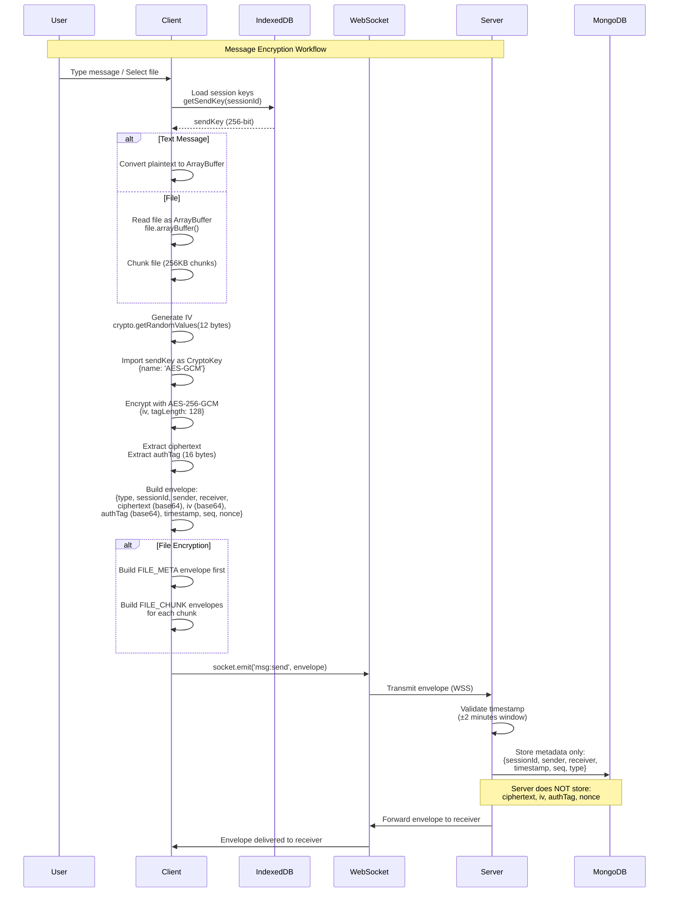
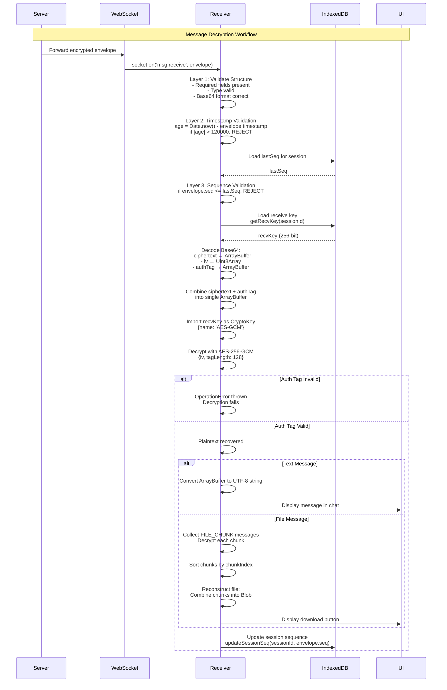

# Encryption & Decryption Workflows

**Generated:** 2025-01-27  
**Version:** 1.0  
**Status:** Complete

---

## Overview

This document provides complete visual and textual documentation of the encryption and decryption workflows for the E2EE messaging system. All workflows are based strictly on the information present in the project documentation.

**Key Features:**
- AES-256-GCM encryption for all messages
- File encryption with 256KB chunking
- Client-side encryption/decryption only
- Server acts as relay (never sees plaintext)
- Multi-layer replay protection
- Metadata-only server storage

---

## Encryption Workflow (Mermaid)

---

## Encryption Workflow Explanation

1. **User Input**: User types a text message or selects a file to send.

2. **Load Session Keys**: Client loads the sendKey from IndexedDB using the sessionId. The sendKey is a 256-bit key derived from the ECDH key exchange protocol.

3. **Prepare Plaintext**: For text messages, convert the plaintext string to an ArrayBuffer. For files, read the file as an ArrayBuffer and optionally chunk it into 256KB pieces.

4. **Generate Initialization Vector (IV)**: Generate a unique 96-bit (12 bytes) cryptographically random IV using `crypto.getRandomValues()`. Each message must use a unique IV.

5. **Import Encryption Key**: Import the sendKey as a CryptoKey object with algorithm `{ name: 'AES-GCM' }` for use with Web Crypto API.

6. **Encrypt with AES-256-GCM**: Perform encryption using `crypto.subtle.encrypt()` with:
   - Algorithm: AES-GCM
   - Key: sendKey (256-bit)
   - IV: 96-bit random IV
   - Tag Length: 128 bits

7. **Extract Ciphertext and Auth Tag**: The encryption result contains both ciphertext and authentication tag. Extract ciphertext as `encrypted.slice(0, -16)` and authTag as `encrypted.slice(-16)` (last 16 bytes).

8. **Build Message Envelope**: Create a JSON envelope containing:
   - `type`: "MSG" for text or "FILE_META"/"FILE_CHUNK" for files
   - `sessionId`, `sender`, `receiver`: Session and participant identifiers
   - `ciphertext`, `iv`, `authTag`: Base64-encoded encryption components
   - `timestamp`: Current time in milliseconds
   - `seq`: Sequence number (strictly increasing)
   - `nonce`: Random nonce for replay protection

9. **Send via WebSocket**: Transmit the envelope to the server using `socket.emit('msg:send', envelope)` over a secure WebSocket connection (WSS).

10. **Server Validation**: Server validates the timestamp is within ±2 minutes of current time to prevent replay attacks.

11. **Server Metadata Storage**: Server stores only metadata (sender, receiver, timestamp, seq, type) in MongoDB. The server never stores ciphertext, IV, authTag, or nonce.

12. **Server Relay**: Server forwards the complete envelope to the intended receiver via WebSocket. The server acts as a relay and cannot decrypt the message content.

13. **File-Specific Steps** (if applicable): For files, first send a FILE_META envelope with encrypted file metadata (filename, size, totalChunks, mimetype), then send FILE_CHUNK envelopes sequentially for each encrypted chunk.

14. **Delivery Confirmation**: The envelope is delivered to the receiver's WebSocket connection, ready for decryption.

---

## Decryption Workflow (Mermaid)

---

## Decryption Workflow Explanation

1. **Receive Envelope**: Receiver receives the encrypted message envelope via WebSocket event `socket.on('msg:receive', envelope)`.

2. **Structure Validation (Layer 1)**: Validate the envelope structure:
   - Check all required fields are present
   - Verify message type is valid ("MSG", "FILE_META", or "FILE_CHUNK")
   - Validate base64 encoding format is correct

3. **Timestamp Freshness Check (Layer 2)**: Calculate message age: `age = Date.now() - envelope.timestamp`. If `Math.abs(age) > 120000` (2 minutes), reject the message as a potential replay attack.

4. **Sequence Number Validation (Layer 3)**: Load the last processed sequence number for this session from IndexedDB. If `envelope.seq <= lastSeq`, reject the message as a replay or out-of-order message. Sequence numbers must be strictly increasing.

5. **Load Receive Key**: Retrieve the recvKey from IndexedDB using `getRecvKey(sessionId)`. The recvKey is the 256-bit key used for decrypting incoming messages in this session.

6. **Decode Base64 Components**: Decode the base64-encoded fields:
   - `ciphertext` → ArrayBuffer
   - `iv` → Uint8Array (12 bytes)
   - `authTag` → ArrayBuffer (16 bytes)

7. **Combine Ciphertext and Auth Tag**: Create a single ArrayBuffer containing both ciphertext and authTag, as required by Web Crypto API for AES-GCM decryption.

8. **Import Decryption Key**: Import the recvKey as a CryptoKey object with algorithm `{ name: 'AES-GCM' }` for use with Web Crypto API.

9. **Decrypt with AES-256-GCM**: Perform decryption using `crypto.subtle.decrypt()` with:
   - Algorithm: AES-GCM
   - Key: recvKey (256-bit)
   - IV: from envelope (96 bits)
   - Tag Length: 128 bits

10. **Authentication Tag Verification**: During decryption, AES-GCM automatically verifies the authentication tag. If the tag is invalid (message was tampered with), decryption throws an `OperationError` and the process stops.

11. **Recover Plaintext**: If decryption succeeds, the plaintext is recovered as an ArrayBuffer. For text messages, convert to UTF-8 string. For files, the ArrayBuffer represents a decrypted chunk.

12. **Update Session State**: Update the session's last sequence number in IndexedDB using `updateSessionSeq(sessionId, envelope.seq)` to prevent replay of this message.

13. **File Reconstruction** (if applicable): For file messages, collect all FILE_CHUNK envelopes, decrypt each chunk, sort by chunkIndex, and combine into a single ArrayBuffer. Create a Blob with the correct mimetype for download.

14. **Render to User**: Display the decrypted message in the chat UI or provide a download button for files. The plaintext is now visible to the user, having been decrypted entirely client-side.

---

## Missing Details

The following details were identified as missing or incomplete in the source documentation, but have been clarified through codebase analysis:

### 1. Nonce Validation
- **Status**: CLARIFIED - Nonce not actively validated on client-side
- **Description**: Nonce is generated and included in envelope but there is no client-side validation logic
- **Code Evidence**: 
  - Nonce is generated in `client/src/crypto/messageEnvelope.js` using `generateNonce()`
  - No validation function found in `client/src/crypto/messageFlow.js` or related files
  - Client-side replay protection relies on timestamp and sequence number validation only
- **Source**: `client/src/crypto/messageFlow.js` (lines 90-117) shows validation layers but no nonce check
- **Impact**: Nonce serves as additional randomness but replay protection primarily relies on sequence numbers, timestamps, and server-side message ID uniqueness
- **Documentation Gap**: README mentions "Verify nonce uniqueness (client-side tracking)" but implementation does not perform this check

### 2. Message ID Generation
- **Status**: CLARIFIED - Server-side generation
- **Description**: Message IDs are generated server-side, not client-side
- **Code Evidence**: 
  - `server/src/utils/replayProtection.js` (lines 105-108): `generateMessageId(sessionId, seq, timestamp)` returns `${sessionId}:${seq}:${timestamp}`
  - Called in `server/src/websocket/socket-handler.js` (line 484) before storing metadata
- **Source**: `server/src/utils/replayProtection.js`, `server/src/websocket/socket-handler.js`
- **Impact**: Client does not generate message IDs; server generates them when storing metadata
- **Documentation Gap**: Documentation did not specify that message ID generation is server-side only

### 3. Error Recovery
- **Status**: CLARIFIED - No automatic retry mechanism
- **Description**: When decryption fails, errors are logged and returned to caller; no automatic retry
- **Code Evidence**: 
  - `client/src/crypto/messageFlow.js` (lines 167-177): Decryption errors caught, logged, and returned as `{ valid: false, error: error.message }`
  - No retry logic found in codebase
  - Errors trigger security event logging (`triggerInvalidSignature`) if auth tag fails
- **Source**: `client/src/crypto/messageFlow.js`
- **Impact**: Failed decryptions require manual retry or user intervention; errors are logged for security monitoring
- **Documentation Gap**: Error handling documented but retry mechanism absence not explicitly stated

### 4. File Chunk Ordering
- **Status**: CLARIFIED - Explicit missing chunk detection
- **Description**: Missing chunks are explicitly detected and cause error; chunks are sorted before decryption
- **Code Evidence**: 
  - `client/src/crypto/fileDecryption.js` (lines 43-51): Chunks sorted by `chunkIndex`, then checked if `sortedChunks.length !== totalChunks`
  - Throws error: `Missing chunks: expected ${totalChunks}, got ${sortedChunks.length}`
  - `client/src/hooks/useChat.js` (lines 76-77): Checks if all chunks received before attempting decryption
- **Source**: `client/src/crypto/fileDecryption.js`, `client/src/hooks/useChat.js`
- **Impact**: Missing chunks cause explicit error; file reconstruction only proceeds when all chunks are present
- **Documentation Gap**: Error handling for missing chunks was not fully documented

### 5. Server Metadata Storage Timing
- **Status**: CLARIFIED - Metadata stored before forwarding
- **Description**: Server stores metadata first, then forwards envelope to receiver
- **Code Evidence**: 
  - `server/src/websocket/socket-handler.js` (lines 499, 506, 514-516):
    1. Line 499: `await messageMeta.save()` - metadata stored FIRST
    2. Line 506: `recipientSocket.emit('msg:receive', envelope)` - then forwarded
    3. Lines 514-516: `delivered` flag updated AFTER forwarding
- **Source**: `server/src/websocket/socket-handler.js`
- **Impact**: Metadata is persisted before forwarding, ensuring delivery tracking even if forwarding fails
- **Documentation Gap**: Exact order of operations (store → forward → update delivered flag) was not explicitly documented

---

## Source Documentation

This document is based on information extracted from the following Markdown files:

- `docs/protocols/MESSAGE_ENCRYPTION_FLOW.md`
- `docs/PHASE4_MESSAGING_DESIGN.md`
- `docs/cryptography/PHASE3_CRYPTO_DESIGN.md`
- `docs/cryptography/CRYPTOGRAPHIC_DESIGN.md`
- `docs/protocols/KEY_EXCHANGE_PROTOCOL.md`

**Codebase Analysis**: Missing details were clarified through analysis of the following source code files:
- `client/src/crypto/messageFlow.js`
- `client/src/crypto/fileDecryption.js`
- `client/src/crypto/messageEnvelope.js`
- `server/src/websocket/socket-handler.js`
- `server/src/utils/replayProtection.js`
- `client/src/hooks/useChat.js`

All workflows, steps, and technical details are derived strictly from the source documentation and verified against the codebase. No steps were invented or assumed.

---

**Document Version**: 1.0  
**Last Updated**: 2025-01-27  
**Generated From**: Phase 1-3 Documentation Extraction Process

