# Key Exchange Protocol Diagram

## Overview

This document provides a visual representation of the Key Exchange Protocol (KEP) used in the E2EE messaging system. The protocol establishes secure session keys between two parties (Alice and Bob) using authenticated ECDH (Elliptic Curve Diffie-Hellman) with digital signatures and HKDF key derivation.

**Key Security Properties:**

- **MITM Protection**: Ephemeral keys are signed with identity keys, preventing man-in-the-middle attacks
- **Forward Secrecy**: Ephemeral keys are discarded after session establishment
- **Replay Protection**: Timestamps, sequence numbers, and nonces prevent replay attacks
- **Server Trust Model**: Server acts as relay only, cannot decrypt or modify messages

The protocol uses only Web Crypto API (browser) and Node.js crypto modules—no external E2EE libraries.

---

## Protocol Flow Diagram

```mermaid
sequenceDiagram
    participant Alice
    participant Server
    participant Bob

    Note over Alice,Bob: Identity Key Lookup Phase
    Alice->>Server: GET /api/keys/:bobId
    Server-->>Alice: { publicKey: IK_pub_B (JWK) }
    Bob->>Server: GET /api/keys/:aliceId
    Server-->>Bob: { publicKey: IK_pub_A (JWK) }

    Note over Alice,Bob: Ephemeral Key Generation & Signing
    Alice->>Alice: Generate ECDH P-256 ephemeral key pair<br/>(EK_priv_A, EK_pub_A)
    Alice->>Alice: Export EK_pub_A to JWK format
    Alice->>Alice: Sign EK_pub_A with IK_priv_A<br/>(ECDSA-SHA256)
    Bob->>Bob: Generate ECDH P-256 ephemeral key pair<br/>(EK_priv_B, EK_pub_B)
    Bob->>Bob: Export EK_pub_B to JWK format
    Bob->>Bob: Sign EK_pub_B with IK_priv_B<br/>(ECDSA-SHA256)

    Note over Alice,Bob: KEP_INIT Message Flow
    Alice->>Alice: Create KEP_INIT message:<br/>{type, from, to, sessionId,<br/>ephPub (JWK), signature,<br/>timestamp, seq: 1, nonce}
    Alice->>Server: WebSocket: kep:init (KEP_INIT)
    Server->>Server: Validate timestamp (±2 min)<br/>Store metadata only
    Server->>Bob: WebSocket: kep:init (KEP_INIT)

    Note over Bob: KEP_INIT Verification
    Bob->>Bob: Verify timestamp freshness (±2 min)
    Bob->>Bob: Import IK_pub_A from server response
    Bob->>Bob: Verify signature on ephPub<br/>using IK_pub_A (ECDSA-SHA256)
    alt Signature Invalid
        Bob->>Bob: REJECT: Log to invalid_signature.log
    else Signature Valid
        Note over Bob: Shared Secret & Key Derivation
        Bob->>Bob: Import EK_pub_A (JWK) as ECDH key
        Bob->>Bob: Compute shared secret:<br/>ECDH(EK_priv_B, EK_pub_A) → 256 bits
        Bob->>Bob: Derive rootKey:<br/>HKDF(sharedSecret, "ROOT", sessionId, 256)
        Bob->>Bob: Derive sendKey:<br/>HKDF(rootKey, "SEND", bobId, 256)
        Bob->>Bob: Derive recvKey:<br/>HKDF(rootKey, "RECV", aliceId, 256)
        Bob->>Bob: Generate key confirmation:<br/>HMAC-SHA256(rootKey, "CONFIRM:"+aliceId)
        Bob->>Bob: Sign EK_pub_B with IK_priv_B

        Note over Alice,Bob: KEP_RESPONSE Message Flow
        Bob->>Bob: Create KEP_RESPONSE message:<br/>{type, from, to, sessionId,<br/>ephPub (JWK), signature,<br/>keyConfirmation, timestamp,<br/>seq: 2, nonce}
        Bob->>Server: WebSocket: kep:response (KEP_RESPONSE)
        Server->>Server: Store metadata only
        Server->>Alice: WebSocket: kep:response (KEP_RESPONSE)

        Note over Alice: KEP_RESPONSE Verification
        Alice->>Alice: Verify timestamp freshness (±2 min)
        Alice->>Alice: Import IK_pub_B from server response
        Alice->>Alice: Verify signature on ephPub<br/>using IK_pub_B (ECDSA-SHA256)
        alt Signature Invalid
            Alice->>Alice: REJECT: Log to invalid_signature.log
        else Signature Valid
            Note over Alice: Shared Secret & Key Derivation
            Alice->>Alice: Import EK_pub_B (JWK) as ECDH key
            Alice->>Alice: Compute shared secret:<br/>ECDH(EK_priv_A, EK_pub_B) → 256 bits
            Alice->>Alice: Derive rootKey:<br/>HKDF(sharedSecret, "ROOT", sessionId, 256)
            Alice->>Alice: Derive sendKey:<br/>HKDF(rootKey, "SEND", aliceId, 256)
            Alice->>Alice: Derive recvKey:<br/>HKDF(rootKey, "RECV", bobId, 256)
            Alice->>Alice: Verify key confirmation:<br/>HMAC-SHA256(rootKey, "CONFIRM:"+aliceId)<br/>== keyConfirmation from message
            alt Key Confirmation Mismatch
                Alice->>Alice: REJECT: Session rejected, keys discarded
            else Key Confirmation Valid
                Note over Alice,Bob: Session Established
                Alice->>Alice: Encrypt session keys (rootKey, sendKey, recvKey)<br/>with password-derived key
                Alice->>Alice: Store encrypted session in IndexedDB
                Bob->>Bob: Encrypt session keys (rootKey, sendKey, recvKey)<br/>with password-derived key
                Bob->>Bob: Store encrypted session in IndexedDB
                Alice->>Alice: Discard ephemeral keys (EK_priv_A, EK_pub_A)
                Bob->>Bob: Discard ephemeral keys (EK_priv_B, EK_pub_B)
                Note over Alice,Bob: ✓ Session Established<br/>Forward Secrecy: Ephemeral keys discarded<br/>MITM Protection: Signatures verified<br/>Replay Protection: Timestamps & nonces validated
            end
        end
    end
```



---

## Step-by-Step Protocol Explanation

### Step 1: Identity Key Lookup

Both parties fetch each other's public identity keys from the server:

- **Alice** requests Bob's public identity key via `GET /api/keys/:bobId`
- **Bob** requests Alice's public identity key via `GET /api/keys/:aliceId`
- Server returns public keys in JWK (JSON Web Key) format
- These identity keys are used to verify signatures on ephemeral keys later in the protocol

**Source**: `docs/protocols/KEY_EXCHANGE_PROTOCOL.md` (lines 9-23)

---

### Step 2: Ephemeral Key Generation

Both parties generate fresh ephemeral ECDH key pairs:

- **Alice** generates: `EK_priv_A` (private, kept in memory) and `EK_pub_A` (public, to be sent)
- **Bob** generates: `EK_priv_B` (private, kept in memory) and `EK_pub_B` (public, to be sent)
- Ephemeral keys use ECDH P-256 algorithm
- Ephemeral keys are single-use and provide forward secrecy
- Both parties export their ephemeral public keys to JWK format

**Source**: `docs/protocols/KEY_EXCHANGE_PROTOCOL.md` (lines 25-33), `docs/cryptography/CRYPTOGRAPHIC_DESIGN.md` (lines 62-79)

---

### Step 3: Signing Ephemeral Keys

Both parties sign their ephemeral public keys with their identity private keys:

- **Alice** signs `EK_pub_A` with `IK_priv_A` using ECDSA-SHA256 algorithm
- **Bob** signs `EK_pub_B` with `IK_priv_B` using ECDSA-SHA256 algorithm
- Signature data: `JSON.stringify(ephemeralPublicKeyJWK)`
- Signatures are base64-encoded
- These signatures prevent MITM attacks by ensuring ephemeral keys are authentic

**Source**: `docs/protocols/KEY_EXCHANGE_PROTOCOL.md` (lines 37-41), `docs/cryptography/CRYPTOGRAPHIC_DESIGN.md` (lines 167-171)

---

### Step 4: KEP_INIT Message Transmission

Alice initiates the key exchange by sending a KEP_INIT message:

- **Alice** creates KEP_INIT message containing:
  - `type`: "KEP_INIT"
  - `from`: aliceId
  - `to`: bobId
  - `sessionId`: unique session identifier
  - `ephPub`: EK_pub_A as JWK format
  - `signature`: base64-encoded signature of ephPub
  - `timestamp`: current timestamp (milliseconds)
  - `seq`: 1 (sequence number)
  - `nonce`: random nonce for replay protection
- **Alice** sends message to server via WebSocket: `socket.emit("kep:init", message)`
- **Server** validates timestamp freshness (±2 minutes window)
- **Server** stores only metadata (not full message) in MongoDB
- **Server** forwards message to Bob via WebSocket (acts as pure relay)

**Source**: `docs/protocols/KEY_EXCHANGE_PROTOCOL.md` (lines 35-55), `README.md` (lines 2474-2509)

---

### Step 5: KEP_INIT Verification (Bob)

Bob receives and verifies Alice's KEP_INIT message:

- **Bob** verifies timestamp freshness: message must be within ±2 minutes of current time
- **Bob** imports Alice's identity public key (`IK_pub_A`) from the server response
- **Bob** verifies signature on `ephPub` using `IK_pub_A` with ECDSA-SHA256 algorithm
- If signature is invalid: Bob rejects message and logs to `invalid_signature.log`
- If signature is valid: Bob proceeds to compute shared secret

**Source**: `docs/protocols/KEY_EXCHANGE_PROTOCOL.md` (lines 57-66), `README.md` (lines 2548-2591)

---

### Step 6: Shared Secret Computation (Bob)

Bob computes the ECDH shared secret:

- **Bob** imports Alice's ephemeral public key (`EK_pub_A`) from KEP_INIT message as ECDH key
- **Bob** computes shared secret: `ECDH(EK_priv_B, EK_pub_A)` → 256-bit shared secret
- The shared secret is 256 bits (32 bytes) of cryptographically strong random data
- This shared secret will be used to derive session keys via HKDF

**Source**: `docs/protocols/KEY_EXCHANGE_PROTOCOL.md` (lines 68-76), `README.md` (lines 2599-2642)

---

### Step 7: Session Key Derivation (Bob)

Bob derives session keys using HKDF-SHA256:

- **Root Key**: `HKDF(sharedSecret, salt="ROOT", info=sessionId, length=256 bits, hash=SHA-256)`
- **Send Key**: `HKDF(rootKey, salt="SEND", info=bobId, length=256 bits, hash=SHA-256)`
- **Receive Key**: `HKDF(rootKey, salt="RECV", info=aliceId, length=256 bits, hash=SHA-256)`
- **Key Confirmation**: Bob generates `HMAC-SHA256(rootKey, "CONFIRM:" + aliceId)`
- Bob signs his ephemeral public key (`EK_pub_B`) with `IK_priv_B` for KEP_RESPONSE

**Source**: `docs/protocols/KEY_EXCHANGE_PROTOCOL.md` (lines 78-86), `docs/cryptography/CRYPTOGRAPHIC_DESIGN.md` (lines 188-192)

---

### Step 8: KEP_RESPONSE Message Transmission

Bob responds with a KEP_RESPONSE message:

- **Bob** creates KEP_RESPONSE message containing:
  - `type`: "KEP_RESPONSE"
  - `from`: bobId
  - `to`: aliceId
  - `sessionId`: same session identifier from KEP_INIT
  - `ephPub`: EK_pub_B as JWK format
  - `signature`: base64-encoded signature of ephPub
  - `keyConfirmation`: base64-encoded HMAC for key confirmation
  - `timestamp`: current timestamp
  - `seq`: 2 (sequence number)
  - `nonce`: random nonce
- **Bob** sends message to server via WebSocket: `socket.emit("kep:response", message)`
- **Server** stores metadata only and forwards to Alice via WebSocket

**Source**: `docs/protocols/KEY_EXCHANGE_PROTOCOL.md` (lines 88-110), `README.md` (lines 2511-2537)

---

### Step 9: KEP_RESPONSE Verification (Alice)

Alice receives and verifies Bob's KEP_RESPONSE message:

- **Alice** verifies timestamp freshness (±2 minutes window)
- **Alice** imports Bob's identity public key (`IK_pub_B`) from the server response
- **Alice** verifies signature on `ephPub` using `IK_pub_B` with ECDSA-SHA256 algorithm
- If signature is invalid: Alice rejects message and logs to `invalid_signature.log`
- If signature is valid: Alice proceeds to compute shared secret

**Source**: `docs/protocols/KEY_EXCHANGE_PROTOCOL.md` (lines 112-121), `README.md` (lines 2593-2597)

---

### Step 10: Shared Secret Computation (Alice)

Alice computes the same ECDH shared secret:

- **Alice** imports Bob's ephemeral public key (`EK_pub_B`) from KEP_RESPONSE message as ECDH key
- **Alice** computes shared secret: `ECDH(EK_priv_A, EK_pub_B)` → 256-bit shared secret
- Due to ECDH mathematical properties, Alice's shared secret is identical to Bob's:
  - `ECDH(EK_priv_A, EK_pub_B) = ECDH(EK_priv_B, EK_pub_A)`

**Source**: `docs/protocols/KEY_EXCHANGE_PROTOCOL.md` (lines 68-76), `README.md` (lines 2599-2642)

---

### Step 11: Session Key Derivation (Alice)

Alice derives the same session keys using HKDF-SHA256:

- **Root Key**: `HKDF(sharedSecret, salt="ROOT", info=sessionId, length=256 bits, hash=SHA-256)`
- **Send Key**: `HKDF(rootKey, salt="SEND", info=aliceId, length=256 bits, hash=SHA-256)`
- **Receive Key**: `HKDF(rootKey, salt="RECV", info=bobId, length=256 bits, hash=SHA-256)`
- Both parties now have matching session keys (Alice's sendKey = Bob's recvKey, and vice versa)

**Source**: `docs/protocols/KEY_EXCHANGE_PROTOCOL.md` (lines 78-86), `docs/cryptography/PHASE3_CRYPTO_DESIGN.md` (lines 410-494)

---

### Step 12: Key Confirmation & Session Establishment

Alice verifies key confirmation to ensure both parties derived the same keys:

- **Alice** computes: `HMAC-SHA256(rootKey, "CONFIRM:" + aliceId)`
- **Alice** compares computed value to `keyConfirmation` from Bob's KEP_RESPONSE message
- If key confirmation matches:
  - Both parties encrypt session keys (rootKey, sendKey, recvKey) using password-derived keys
  - Both parties store encrypted session in IndexedDB
  - Both parties discard ephemeral keys from memory (forward secrecy)
  - **Session is established** ✓
- If key confirmation mismatches:
  - Session is rejected
  - All derived keys are discarded
  - New key exchange must be initiated

**Source**: `docs/protocols/KEY_EXCHANGE_PROTOCOL.md` (lines 114-121), `docs/cryptography/CRYPTOGRAPHIC_DESIGN.md` (lines 194-198)

---

## Missing Details

The following details are not fully documented in the source documentation:

### 1. Identity Key Lookup Timing

**MISSING DETAIL**: The exact timing of identity key lookup relative to ephemeral key generation is not specified. Documentation mentions fetching peer's identity key but does not clarify if this happens before, during, or after ephemeral key generation.

**Source**: `docs/protocols/KEY_EXCHANGE_PROTOCOL.md` mentions identity key lookup but timing is unclear.

---

### 2. Session ID Generation

**MISSING DETAIL**: The documentation mentions `sessionId` in all KEP messages but does not specify:

- Who generates the sessionId (initiator or server)
- How sessionId is generated (algorithm, format, uniqueness guarantees)
- Whether sessionId is validated by the server

**Source**: Multiple files reference sessionId but generation process not documented.

---

### 3. Sequence Number Initialization

**MISSING DETAIL**: Documentation states sequence numbers start at 1 for KEP_INIT and 2 for KEP_RESPONSE, but does not specify:

- How sequence numbers are managed for subsequent messages in the same session
- Whether sequence numbers are reset on key rotation
- How sequence number conflicts are resolved

**Source**: `docs/protocols/KEY_EXCHANGE_PROTOCOL.md` shows seq: 1 and seq: 2 but initialization logic not fully documented.

---

### 4. Nonce Size Specification

**MISSING DETAIL**: Documentation mentions nonces are included in messages but does not consistently specify:

- Exact nonce size (some places say 16 bytes, others just mention "random nonce")
- Nonce generation algorithm
- Nonce validation requirements

**Source**: `docs/protocols/KEY_EXCHANGE_PROTOCOL.md` mentions nonce but size varies in documentation.

---

### 5. Key Confirmation Failure Handling

**MISSING DETAIL**: Documentation states session is rejected if key confirmation fails, but does not specify:

- Whether a new key exchange is automatically initiated
- Whether user action is required to retry
- Error message or notification to the user
- Recovery procedure after key confirmation failure

**Source**: `docs/protocols/KEY_EXCHANGE_PROTOCOL.md` mentions rejection but recovery process not documented.

---

### 6. Ephemeral Key Discard Timing

**MISSING DETAIL**: Documentation states ephemeral keys are discarded after session establishment, but does not specify the exact moment:

- After shared secret computation?
- After key derivation?
- After key confirmation verification?
- After session storage?

**Source**: Multiple files mention discarding but timing is not precise.

---

## Security Properties

### MITM Prevention

- **Digital Signatures**: Ephemeral keys are signed with identity keys, preventing key substitution attacks
- **Signature Verification**: Both parties verify signatures using peer's identity public key
- **Identity Keys**: Long-term keys establish trust and prevent man-in-the-middle attacks

**Source**: `docs/protocols/KEY_EXCHANGE_PROTOCOL.md` (lines 123-130), `docs/cryptography/PHASE3_CRYPTO_DESIGN.md` (lines 512-530)

---

### Forward Secrecy

- **Ephemeral Keys**: Discarded immediately after session establishment
- **Key Rotation**: Periodic rotation maintains forward secrecy (documented in Phase 6)
- **Session Keys**: Derived from ephemeral keys only, not from identity keys

**Source**: `docs/protocols/KEY_EXCHANGE_PROTOCOL.md` (lines 131-135), `docs/cryptography/PHASE3_CRYPTO_DESIGN.md` (line 515)

---

### Replay Protection

- **Timestamps**: Messages must be fresh (±2 minutes window)
- **Sequence Numbers**: Strictly increasing per session (seq: 1 for KEP_INIT, seq: 2 for KEP_RESPONSE)
- **Nonces**: Additional randomness for uniqueness
- **Message ID Uniqueness**: Server generates unique message IDs: `sessionId:seq:timestamp`

**Source**: `docs/protocols/KEY_EXCHANGE_PROTOCOL.md` (lines 137-141), `docs/cryptography/PHASE3_CRYPTO_DESIGN.md` (lines 340-399)

---

### Server Trust Model

- **Relay Only**: Server acts as pure relay, forwarding messages between clients
- **Metadata Storage**: Server stores only metadata (sender, receiver, sessionId, timestamp, seq)
- **No Decryption**: Server cannot decrypt messages or verify signatures
- **No Modification**: Server does not modify message content

**Source**: `docs/protocols/KEY_EXCHANGE_PROTOCOL.md` (lines 55, 110), `README.md` (lines 2539-2546)

---

## Cryptographic Specifications

### Identity Keys

- **Algorithm**: ECDSA
- **Curve**: P-256 (prime256v1)
- **Key Size**: 256 bits
- **Usage**: Sign ephemeral keys during key exchange
- **Storage**: Private key encrypted in IndexedDB, public key stored on server

**Source**: `docs/cryptography/CRYPTOGRAPHIC_DESIGN.md` (lines 38-50)

---

### Ephemeral Keys

- **Algorithm**: ECDH
- **Curve**: P-256
- **Key Size**: 256 bits
- **Usage**: Compute shared secret via ECDH
- **Storage**: Memory only (never persisted)
- **Lifecycle**: Single-use, discarded after session establishment

**Source**: `docs/cryptography/CRYPTOGRAPHIC_DESIGN.md` (lines 62-79)

---

### Session Keys

- **Derivation**: HKDF-SHA256 from ECDH shared secret
- **Root Key**: 256 bits, derived from shared secret
- **Send Key**: 256 bits, derived from root key
- **Receive Key**: 256 bits, derived from root key
- **Storage**: Encrypted in IndexedDB using password-derived key

**Source**: `docs/cryptography/CRYPTOGRAPHIC_DESIGN.md` (lines 81-100)

---

## Message Formats

### KEP_INIT Message

```json
{
  "type": "KEP_INIT",
  "from": "aliceId",
  "to": "bobId",
  "sessionId": "session-123",
  "ephPub": {
    "kty": "EC",
    "crv": "P-256",
    "x": "base64",
    "y": "base64"
  },
  "signature": "base64",
  "timestamp": 1234567890,
  "seq": 1,
  "nonce": "base64"
}
```

**Source**: `docs/protocols/KEY_EXCHANGE_PROTOCOL.md` (lines 143-164)

---

### KEP_RESPONSE Message

```json
{
  "type": "KEP_RESPONSE",
  "from": "bobId",
  "to": "aliceId",
  "sessionId": "session-123",
  "ephPub": {
    "kty": "EC",
    "crv": "P-256",
    "x": "base64",
    "y": "base64"
  },
  "signature": "base64",
  "keyConfirmation": "base64",
  "timestamp": 1234567891,
  "seq": 2,
  "nonce": "base64"
}
```

**Source**: `docs/protocols/KEY_EXCHANGE_PROTOCOL.md` (lines 166-186)

---

## References

- [Key Exchange Protocol (KEP)](./KEY_EXCHANGE_PROTOCOL.md) - Detailed protocol specification
- [Cryptographic Design](../cryptography/CRYPTOGRAPHIC_DESIGN.md) - Complete cryptographic architecture
- [Phase 3 Crypto Design](../cryptography/PHASE3_CRYPTO_DESIGN.md) - E2EE foundation implementation
- [README.md](../../README.md) - Project overview and protocol details

---

**Document Version**: 1.0  
**Last Updated**: 2025-01-27  
**Status**: Complete  
**Based On**: Documentation analysis from Phase 1 & 2
